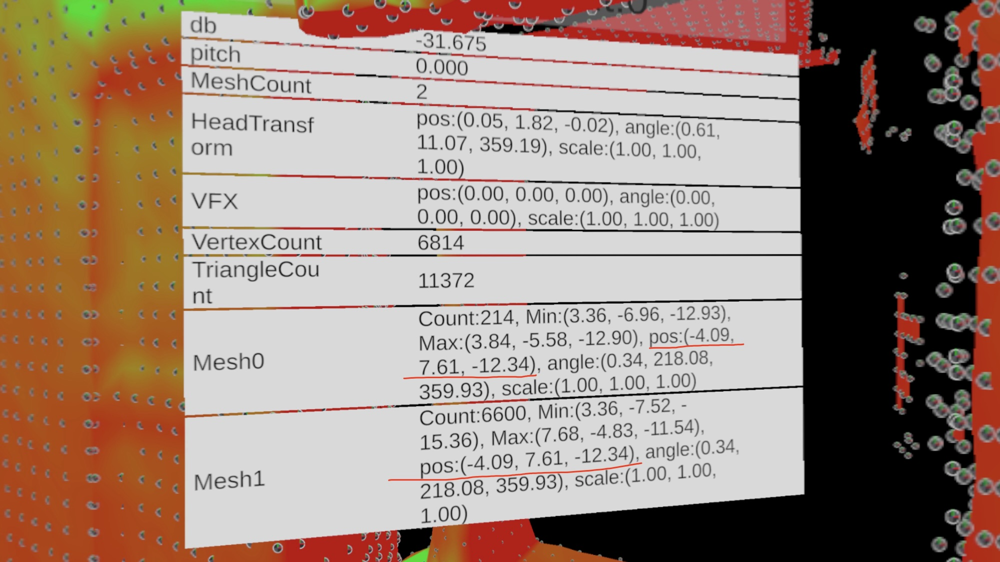

## What is EchoVision

EchoVision is a mixed reality art experience simulating the bat echolocation, where users' voices are visually represented in the surrounding environment. This allows users to experience what it feels like to be a bat.  

EchoVision is open-sourced and serving as a sample project for [HoloKit](https://holokit.io/), an Open-Source Mixed Reality Headset created by Holo Interactive.

EchoVision is designed for iOS and visionOS. The iOS version is compatible with iPhones equipped with a LiDAR camera, while the visionOS version is specifically designed for Apple Vision Pro.

## How to play

### iOS

EchoVision requires the iPhone model with a Lidar camera***, since EchoVision utilizes the Meshing and Human Segmentation features from Apple ARKit.

You can download the app from App Store by searching "EchoVision". 

- Mono Mode 
  In this mode, users can interactive with EchoVision without HoloKit.
- Stereo Mode 
  In this mode, user can get a more immersive AR experience with HoloKit.

### visionOS
- Download the app from app store by searching "EchoVision Pro". 
- Start the app and the app will be running in Fully Immersive Mode in which surrounding environment would turn totally black by default.
- Generate voices to see the effects.

## How to compile?
### System Requirements
- macOS 15+ with computers with Apple Silicon Chip inside
- Unity 6.1+

### iOS version

- Change build profile to "iOS" in `Build profiles`

### visionOS version

- Change build profile to "visionOS" in `Build profiles`

## Known issues
- Microphone might not work properly when recording due to the occupancy by the audio analyzor and the recorder at the same time. 

## Important Note about migration from iOS version
We use ARMeshManager of ARFoundation to generate meshes of surrounding environment. 
From the actual practice in iOS and the discussions in various posts, the Meshes generated by ARMeshManager should stay at (0,0,0), and the Vertices in the Meshes will be at the actual coordinates.  
However, when using ARMeshManager in VisionPro, the Meshes generated by ARMeshManager all have the same non-zero positions and rotations, which leads to problems when directly using coordinates of Verties in the Meshes to generate effects.  
> Remember to convert the local coordinates to world coordinates first. It has been taken care of in this project.

